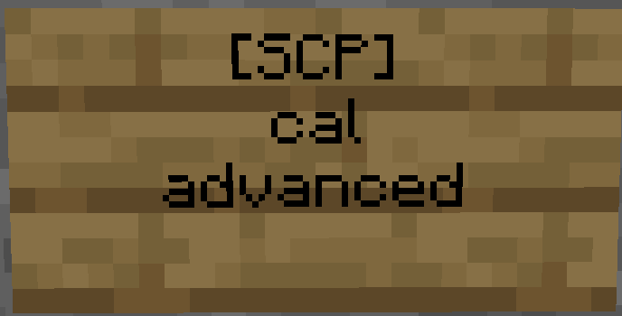
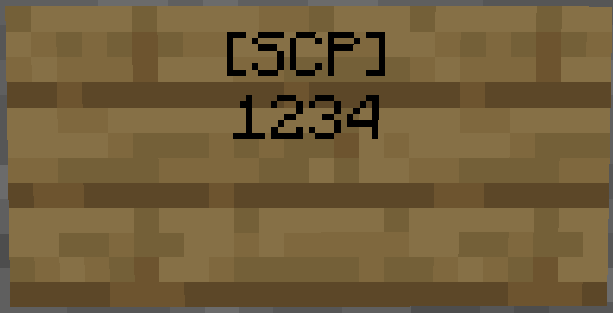

# Sign code pad
Sign code pad creates interactive code pad signs. The torch behind the sign is replaced with a redstone torch for a few seconds when the correct code has been entered. The torch can be used to open doors or trigger something using redstone.

## Instructions
### Calibration (required)

* Create a wall sign.
* Write "[SignCodePad]" or "[SCP]" on the first line.
* Write "cal" on the second line.
* Press "Done".
* Press each cross until the sign is removed.

### Advanced Calibration (optional)

* Create a wall sign.
* Write "[SignCodePad]" or "[SCP]" on the first line.
* Write "cal" on the second line.
* Write "advanced" on the third line
* Press each cross until the sign is removed.

### Create code pad

* Make sure the second block behind the wall sign is air.
* Create a wall sign.
* Write "[SignCodePad]" or "[SCP]" on the first line.
* Enter password on the second line (4 numbers).
* Press "Done"
* A wall torch is created behind the wall sign. Enter your code to activate the redstone wall torch.

### Create advanced code pad

* Make sure each torch location is air.
* Create a wall sign.
* Write "[SignCodePad]" or "[SCP]" on the first line.
* Enter password on the second line (4 numbers).
* On the third line, enter ok torch location: "delay; position relative to sign forward(+)/backward(-), up(+)/down(-), left(-)/right(+); torch direction(N, S, W or E)".
* On the fourth line, enter error torch location : "delay; position relative to sign forward(+)/backward(-), up(+)/down(-), left(-)/right(+); torch direction(N, S, W or E)".
* Press "Done"
* An OK-torch and Error torch are created. The OK torch becomes a redstone torch when the correct code is entered and the Error torch becomes a redstone torch when the wrong code is entered

An example of the advanced code pad sign above. The left torch is the Error torch and right is the OK torch.

### Installation
* Add .jar file to plugin folder.

### Permissions
* signcodepad.use (Permission to use a SignCodePad an the SignCodePad Calibration)[User]
* signcodepad.create (Permission to create a SignCodePad)[User]
* signcodepad.replaceblock (Permission to replace a not air block with a torch)[Admin]
* signcodepad.masterdestroy (Permission to destroy SignCodePads without being the owner)[Admin]

### Sign code pad

### Correct code

### Wrong code

## License

More Information on http://dev.bukkit.org/server-mods/signcodepad/

License - GPLv3

SignCodePad - A CodePad for Minecraft based on Signs
Copyright (C) 2011  davboecki

This program is free software: you can redistribute it and/or modify
it under the terms of the GNU General Public License as published by
the Free Software Foundation, either version 3 of the License, or
(at your option) any later version.

This program is distributed in the hope that it will be useful,
but WITHOUT ANY WARRANTY; without even the implied warranty of
MERCHANTABILITY or FITNESS FOR A PARTICULAR PURPOSE.  See the
GNU General Public License for more details.

You should have received a copy of the GNU General Public License
along with this program.  If not, see <http://www.gnu.org/licenses/>.